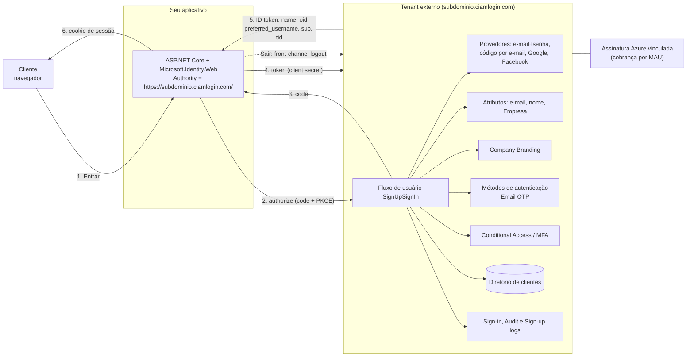
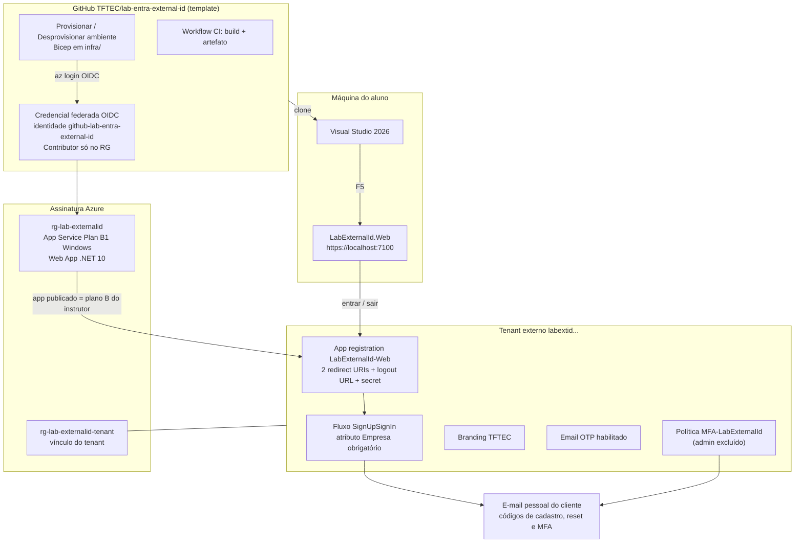
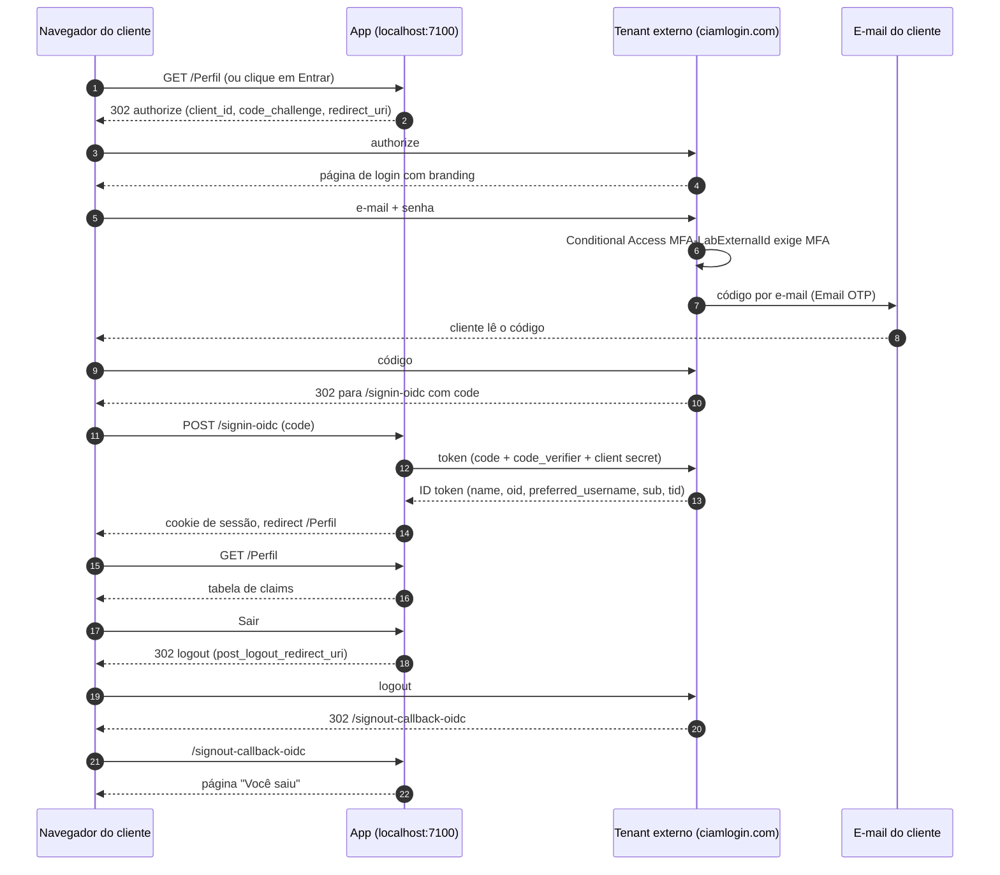

# Módulo 0 — Introdução: o que vamos fazer e por quê

Leitura de apoio e roteiro de fala dos 10 primeiros minutos da aula. Sem slides: este arquivo é o material.
Vocabulário canônico em [CONTEXT.md](../CONTEXT.md). A criação do tenant é feita **antes** da aula, em
[pre-aula.md](pre-aula.md).

## Agenda da aula

| # | Módulo | Min | Guia |
|---|--------|-----|------|
| pré | Preparação: tenant externo, Visual Studio 2026, e-mail de teste | pré-aula | [pre-aula.md](pre-aula.md) |
| 0 | Introdução: agenda, conceitos, arquitetura (este arquivo) | 10 | [00-introducao.md](00-introducao.md) |
| 1 | Tour do tenant no Microsoft Entra admin center | 5 | [01-tour-tenant.md](01-tour-tenant.md) |
| 2 | Company Branding | 10 | [02-branding.md](02-branding.md) |
| 3 | Atributo customizado e fluxo de usuário | 15 | [03-fluxo-de-usuario.md](03-fluxo-de-usuario.md) |
| 4 | App registration e app .NET: entrar, claims, sair; variação sem secret | 30 | [04-app-registration-e-app-dotnet.md](04-app-registration-e-app-dotnet.md) |
| 5 | Reset de senha pelo próprio cliente | 10 | [05-reset-de-senha.md](05-reset-de-senha.md) |
| 6 | MFA com Conditional Access | 15 | [06-mfa-conditional-access.md](06-mfa-conditional-access.md) |
| 7 | Usuários, logs e encerramento | 10 | [07-usuarios-logs-encerramento.md](07-usuarios-logs-encerramento.md) |
| — | Folga | 5 | |
| **Total obrigatório** | | **110** | |
| 8 | Opcional: deploy em App Service pelo portal (Deployment Center) | 15 | [08-opcional-deploy-app-service.md](08-opcional-deploy-app-service.md) |
| 9 | Opcional: provisionar com GitHub Actions e Bicep | 15 + 5 | [09-opcional-provisionamento-actions.md](09-opcional-provisionamento-actions.md) |
| B | Bônus: Google e Facebook como provedores de identidade | 20–45 | [bonus-google.md](bonus-google.md), [bonus-facebook.md](bonus-facebook.md) |

Regra da aula: ninguém avança de módulo enquanto o checkpoint não estiver na tela de todo mundo. Quem travar
usa o plano B: entra como cliente no app publicado do instrutor e acompanha os módulos 5 e 6 por ali.

## O que é o Microsoft Entra External ID

Microsoft Entra External ID é o produto da Microsoft para identidades de fora da sua organização. Ele existe
em dois sabores, e a confusão entre eles é a fonte de quase todo mal-entendido sobre o tema:

| | Tenant corporativo (workforce) | Tenant externo (CIAM) |
|---|---|---|
| Quem entra | Funcionários e **convidados B2B** de outras organizações | **Clientes** e consumidores que se cadastram sozinhos |
| Onde vive | No mesmo diretório da empresa, com Microsoft 365 | Em um **diretório separado**, criado a partir de uma assinatura Azure |
| Experiência | Login corporativo padrão | Fluxos de cadastro e entrada, branding próprio, provedores sociais |
| Domínio de login | `login.microsoftonline.com` | `<subdominio>.ciamlogin.com` |
| "Identidade externa" significa | Convidado | Conta de cliente ou provedor social |

Este lab é inteiramente sobre o **tenant externo**. Por isso usamos sempre as palavras **cliente** e
**provedor de identidade**, nunca "identidade externa", que muda de sentido conforme o tenant.

O tenant externo não tem Microsoft 365, não aparece no Microsoft 365 admin center e não faz SSO para apps
Microsoft. É um diretório de clientes com app registrations, e só isso. O console é o **Microsoft Entra
admin center** (`entra.microsoft.com`); o portal do Azure entra apenas para o App Service dos módulos 8 e 9.

## External ID versus Azure AD B2C

O Azure AD B2C foi o produto CIAM da Microsoft por quase dez anos. O External ID em tenant externo é o
sucessor. Comparação do que muda na prática:

| Aspecto | Azure AD B2C | External ID (tenant externo) |
|---|---|---|
| Disponibilidade | Fechado para **novos clientes desde 1º de maio de 2025**; clientes existentes suportados até pelo menos maio de 2030 | Produto atual; onde nascem os projetos novos |
| Modelo de configuração | User flows básicos ou **custom policies em XML** (Identity Experience Framework) | Fluxos de usuário no portal + **extensões de autenticação customizadas** (eventos chamando uma API sua) |
| Domínio de login | `<tenant>.b2clogin.com` | `<subdominio>.ciamlogin.com` |
| Console | Portal do Azure | Microsoft Entra admin center |
| Provedores de identidade | Locais, sociais, OIDC/SAML | Locais (e-mail+senha, código por e-mail), Google, Facebook, Apple, OIDC, SAML/WS-Fed |
| MFA | Por e-mail ou SMS dentro do fluxo | **Email OTP grátis**; SMS como add-on pago; passkeys (exigem domínio customizado) |
| Conditional Access | Limitado | Conjunto reduzido, mas nativo do Entra (usuários, recursos, localização, plataforma) |
| Branding | Page UI customization por política | **Company Branding** do tenant, com temas |
| Autenticação nativa (UI dentro do app mobile) | Não | Sim |
| Logs | 7 dias, exportáveis | 7 dias; exportação via Azure Monitor em preview |
| Precificação | MAU | MAU (núcleo grátis até 50.000) + add-ons |
| Migração | — | **Não há migração automática** de B2C para External ID; a Microsoft recomenda começar projetos novos em External ID |

O que se ganha: um produto dentro do Entra ID de verdade (mesmos painéis de usuários, logs, Conditional
Access, métodos de autenticação) e sem XML. O que ainda não existe: domínio customizado sem Azure Front Door,
ID Protection, e algumas políticas avançadas que o B2C fazia com custom policies.

## Futuro do CIAM na Microsoft

O que a documentação de 2025–2026 já mostra como direção:

- **Passkeys e FIDO2** como método de entrada e segundo fator para clientes, dependentes de domínio de URL
  customizado. Adeus senha como padrão.
- **Autenticação nativa**: a tela de login desenhada dentro do app mobile, com a MSAL falando com o tenant
  sem redirecionar para o navegador. Só contas locais por enquanto.
- **Extensões de autenticação customizadas** para tenant externo: eventos `OnAttributeCollectionStart`,
  `OnAttributeCollectionSubmit`, `OnOtpSend` e `TokenIssuanceStart` chamando uma API sua para validar dados,
  bloquear cadastros, enviar o código por um provedor próprio de e-mail, ou enriquecer o token.
- **Security Store**: integrações de proteção contra fraude de cadastro e bots (Arkose Labs, HUMAN Security)
  e WAF (Cloudflare, Akamai) plugadas ao fluxo.
- **Observabilidade**: Azure Monitor e Microsoft Sentinel para tenant externo (preview); os dashboards
  "User Insights" foram aposentados em 31 de agosto de 2026, e o caminho é Log Analytics.
- **MFA com authentication context** no Conditional Access, para pedir MFA só em operações sensíveis do app.
- **Ainda não suportado** em tenant externo: Identity Protection, e durante o preview alguns recursos que
  exigem licença premium.

Leitura: o CIAM da Microsoft está convergindo para o mesmo motor do Entra corporativo. Quem souber Entra ID
vai se sentir em casa no tenant externo, e o inverso também.

## Precificação

- **Núcleo do External ID**: os primeiros **50.000 usuários ativos por mês (MAU)** são grátis; acima disso,
  cobrança por MAU. Um MAU é um cliente que autenticou pelo menos uma vez no mês.
- **Add-ons**, sem tier grátis: **SMS** para MFA e reset (cobrado por transação, com opt-in por país desde
  2025), **autenticação M2M** (por transação), **Go-Local** (residência de dados), **ID Governance** e
  **Global Secure Access para convidados**.
- O tenant externo precisa estar **vinculado a uma assinatura Azure** de um tenant corporativo; é por ela
  que a cobrança acontece. Add-ons são comprados nessa assinatura, não no tenant externo.
- **Custo deste lab**: o tenant e tudo que fazemos nele cabem no tier grátis. O que custa dinheiro é o
  **App Service B1** dos módulos 8 e 9, cobrado por hora; por isso os guias terminam apagando o resource group.

Tabela oficial: <https://learn.microsoft.com/entra/external-id/external-identities-pricing>.

## Arquitetura: como o External ID funciona

Pontos a falar enquanto o diagrama está na tela:

- O app nunca vê senha nem código: tudo acontece em `ciamlogin.com`. O app recebe um **code**, troca por
  tokens com o **client secret**, e guarda um cookie.
- O **fluxo de usuário** é o centro: ele decide provedores, atributos coletados e layout. Um app tem um fluxo;
  um fluxo serve vários apps.
- **Branding**, **métodos de autenticação** e **Conditional Access** são configurações do tenant, não do
  fluxo; valem para todos os apps.
- O **sub** é estável por par cliente + aplicativo; o **oid** é o mesmo em qualquer app do tenant.

## Arquitetura: o que implementamos no lab

O aluno executa a coluna da esquerda e o tenant; o instrutor mantém o App Service publicado como plano B; o
GitHub guarda o guia, o app e a automação.

## Fluxo de uma entrada com MFA

Se o cliente demorar mais de 15 minutos entre o passo 2 e o passo 11 (esperando o código, por exemplo), o app
responde **Correlation failed**: é só clicar em Entrar de novo.

## Referências

- Tipos de tenant: <https://learn.microsoft.com/entra/external-id/tenant-configurations>
- Visão geral do tenant externo: <https://learn.microsoft.com/entra/external-id/customers/overview-customers-ciam>
- FAQ, incluindo B2C e migração: <https://learn.microsoft.com/entra/external-id/customers/faq-customers>
- Fim de venda do Azure AD B2C: <https://learn.microsoft.com/azure/active-directory-b2c/faq>
- Recursos suportados em tenant externo: <https://learn.microsoft.com/entra/external-id/customers/concept-supported-features-customers>
- Métodos de autenticação: <https://learn.microsoft.com/entra/external-id/customers/concept-authentication-methods-customers>
- MFA: <https://learn.microsoft.com/entra/external-id/customers/concept-multifactor-authentication-customers>
- Domínio de URL customizado: <https://learn.microsoft.com/entra/external-id/customers/concept-custom-url-domain>
- Preços: <https://learn.microsoft.com/entra/external-id/external-identities-pricing>
- Novidades: <https://learn.microsoft.com/entra/external-id/whats-new-docs>
- Logs de cadastro: <https://learn.microsoft.com/entra/identity/monitoring-health/concept-sign-ups>
