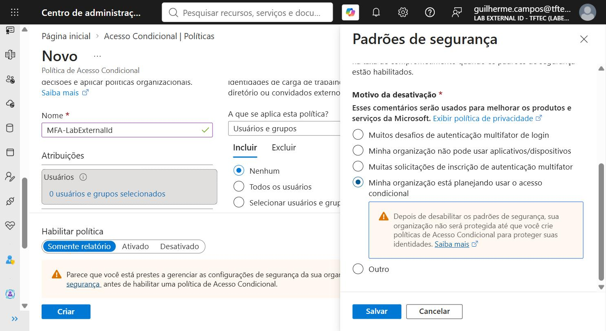

# Módulo 6 — MFA com Conditional Access

## Objetivo

Exigir um segundo fator (código por e-mail) para todo cliente que entrar no app, usando uma política de
Conditional Access. Ver o pedido de MFA aparecer no login sem mudar nada no código.

## Tempo estimado

15 minutos.

## Pré-requisitos

- Módulo 5 concluído: o método **Email OTP** está habilitado para todos os usuários. Ele é o único segundo
  fator gratuito em tenant externo: SMS é add-on pago, passkey exige domínio customizado, e o Microsoft
  Authenticator não é suportado para clientes.

## Passos

### A. Desligar os Security defaults (uma vez por tenant)

Tenant externo novo vem com **Security defaults** habilitado, e o portal não deixa ativar uma política de
Conditional Access enquanto eles estiverem ligados (o assistente mostra um aviso amarelo com o link para
desabilitar). Faça antes de criar a política:

1. **Entra ID > Overview > Properties**, no fim da página, **Manage security defaults**.
   (Ou clique no link **disable security defaults** do aviso amarelo dentro do assistente de nova política.)
2. **Security defaults**: `Disabled (not recommended)`. Em **Reason for disabling**, marque `My organization is
   planning to use Conditional Access` e **Save**. O aviso amarelo do assistente some depois de recarregar.

   

### B. Criar a política

1. **Entra ID > Conditional Access > Policies > + New policy**.
2. **Name**: `MFA-LabExternalId`.
3. **Assignments > Users**:
   - Aba **Include**: **All users**.
   - Aba **Exclude**: marque **Users and groups** e selecione **a sua conta de administrador**.
     Motivo: a política vale para o administrador também, e ele não tem os mesmos métodos que o cliente.
     Sem a exclusão você pode se trancar para fora do portal do tenant.
4. **Assignments > Target resources**:
   - **Select resources**, clique em **Select**, marque **LabExternalId-Web** e confirme.
   - Alternativa mais ampla: **All resources (formerly 'All cloud apps')**. No lab, prefira só o app.
5. **Access controls > Grant**: **Grant access**, marque **Require multifactor authentication**, **Select**.
6. **Enable policy**: **On**.
7. **Create**.

### C. Testar como cliente

8. No app, clique em **Sair** e depois em **Entrar**.
9. Informe e-mail e senha do cliente. O tenant agora pede um **código de verificação** enviado ao e-mail.
10. Informe o código. O app recebe o login: **Olá, <nome>**.
11. **Meu perfil**: a claim `amr` (se presente) ou a lista de claims não muda de forma visível; o efeito do
    MFA aparece no log de entrada, no módulo 7.

### D. Ver a política em ação (opcional, 2 minutos)

12. **Entra ID > Conditional Access > Policies > MFA-LabExternalId**: mude **Enable policy** para
    **Report-only**, **Save**, e entre de novo no app: sem pedido de código. Volte para **On**.

## Checkpoint

- A política `MFA-LabExternalId` está **On**, com **All users** exceto o administrador, mirando
  **LabExternalId-Web** e exigindo MFA.
- O login do cliente pediu o código por e-mail.

## Se der errado

- **Botão Create desabilitado ou aviso "disable security defaults"**: os Security defaults ainda estão
  ligados. Passo A.
- **Não pediu MFA**: a política leva até alguns minutos para valer; o navegador pode ter sessão antiga
  (use janela anônima); o app selecionado em Target resources não é o `LabExternalId-Web`; ou a política
  ficou em Report-only.
- **Cliente vê "You can't access this right now" ou pedido de método indisponível**: Email OTP não está
  habilitado em `Authentication methods > Policies` (módulo 5).
- **Você, administrador, ficou sem acesso ao tenant**: entre pelo tenant corporativo em
  `https://entra.microsoft.com`, troque para o tenant externo e edite a política excluindo sua conta.
  A exclusão do passo 3 existe para isso não acontecer.
- **A política não lista o app**: o app registration não gerou um service principal visível. Use
  **All resources** e siga.
